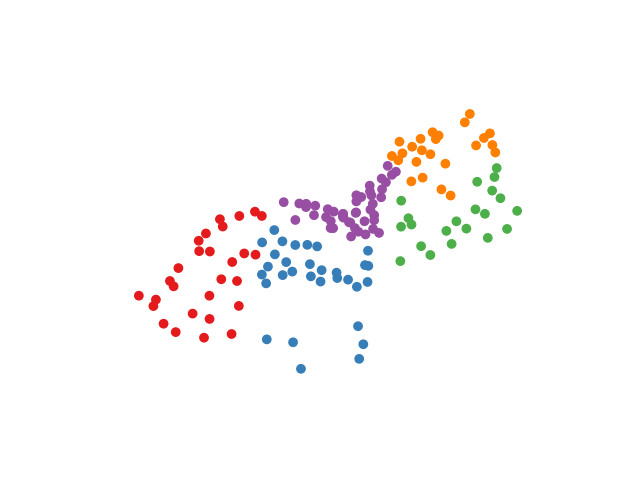

# Bike-stations-locations-clustering

A sctipt for clustering the bike stations in a city using their location. First, the model is trained using either K-means or Agglomerative Hierarchical Clustering for a user choosen number of cluster. And second, the clsuters are displayed in using an intertactive html map or matplotlib standard figure.
The intertactive map need to be saved on the computer in order to be displayed and requires the package folium. The standard figure can also be saved by pasing a path using the command lien options. New labed json file is also saved.

Using the static data (json files) provided by [JCDecaux](https://developer.jcdecaux.com/#/opendata/vls?page=static), you can visulize the clusters of bike stations of any city. The lattitude and longitude of the city are required to use the interactive map (set to Brisbane by default).

See the [requirements.txt](./requirements.txt) file for the dependencies.

## Getting Started

The script is lunched through the command line: 

```

python bike_station.py -i ./data/Brisbane_CityBike.json 

```

The command's line arguments are:

```

  -h, --help	show this help message and exit
  -n N_CLUSTERS, --n_clusters N_CLUSTERS	number of clusters.
  -l {map,figure}, --plot {map,figure}	method of desplaying cluters: - map: interractive html map. - figrue: standard figrue.
  -m {kmeans,ahc}, --model {kmeans,ahc}	model used for clustering the bike stations.
  -p PATH, --path PATH  path where the figure need to be saved.
  -i FILE_PATH, --file_path FILE_PATH  path of json data file.
  -c CITY, --city CITY lattitude and longitude of the city

```

# Visualization

### Brisbane city map clustering (interactive map)

```

python bike_stations.py -n 5 -l map -i ./data/Brisbane_CityBike.json -m kmeans

```


### Brisbane city map clustering (standard figure)

```

python bike_stations.py -n 5 -l figure -i ./data/Brisbane_CityBike.json -m kmeans

```



### Lyon city map clustering (45.74846 4.84671)

```

python bike_stations.py -n 5 -l map -i ./data/Lyon.json -m kmeans -c 45.74846 4.84671 

```

